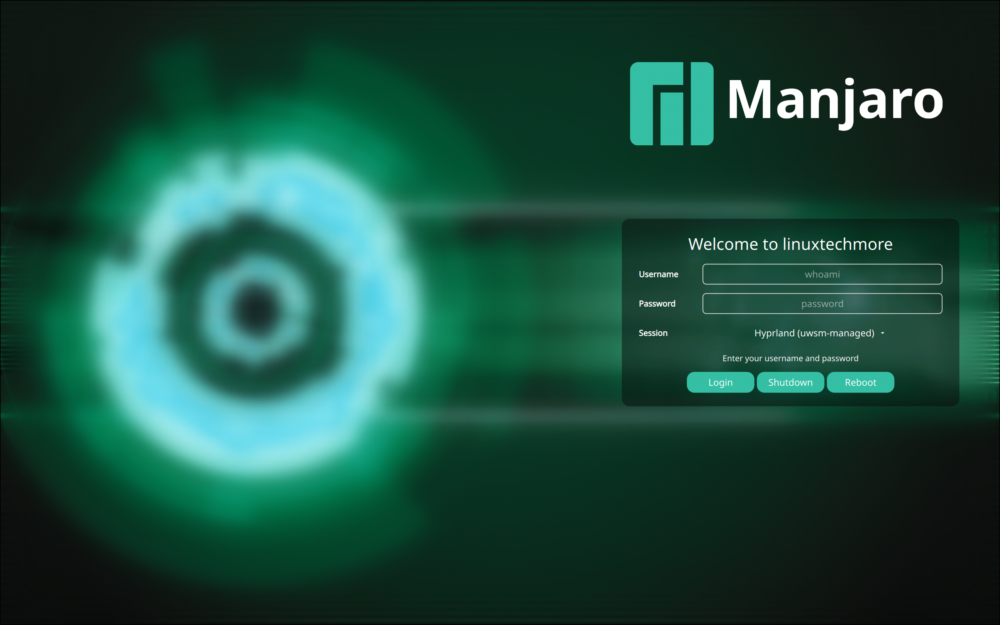
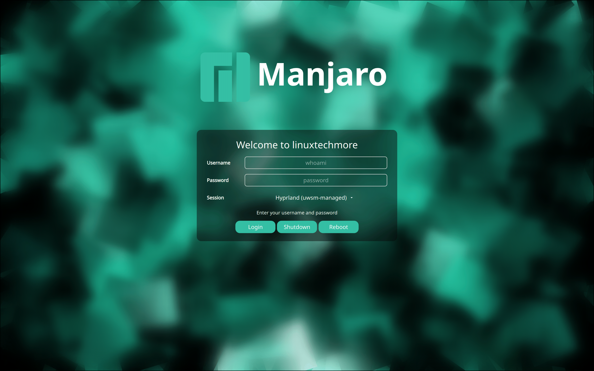

# Elegant Manjaro Linux SDDM Theme

<p align="center">
  
  
</p>

Originally released in 2016, I have completely modernized **Elegant Manjaro Linux** SDDM theme to meet today's standards while keeping the classic elegance you love.

Rebuilt from the ground up with **Qt 6**, it is now faster, smoother, and fully future-proof. Whether you are on a standard laptop or a 4K monitor, it scales perfectly.

## Features

-   **Two Layouts**: Choose between "Side" (Classic) or "Center" (Modern) layout.
-   **Dynamic Dropdown**: Session menu auto-adjusts width based on content.
-   **Glassmorphism**: Elegant blur effects and transparency.
-   **High DPI Ready**: I made everything scalable, so it looks crisp on any screen.
-   **Qt 6 Powered**: Built using modern QtQuick modules.
-   **Modular Design**: Structured neatly so you can easily tweak it.
-   **Dynamic Welcome**: Displays your system hostname (e.g., "Welcome to Manjaro").

## Installation

### One-Line Install (Interactive)

This script will automatically detect your distribution, install dependencies, and let you **choose your preferred Layout** (Side or Center) and **Blur Strength** (None, Medium, or Strong) before activating the theme.

Run this command on **Manjaro, Arch, Fedora, Debian**, or any supported Linux distribution:
```bash
curl -sSL https://raw.githubusercontent.com/sniper1720/elegant-sddm-manjarolinux-theme/main/install.sh | sudo bash
```

### Install via AUR (Arch & Manjaro)

You can easily install this theme from the AUR using your favorite helper (e.g., `yay` or `paru`):

```bash
yay -S sddm-theme-elegant-manjarolinux-git
```
> [!NOTE]
> After installing from AUR, run `sudo /usr/share/sddm/themes/elegant-manjarolinux/customize.sh` to customize and activate it!

### Install via KDE System Settings

If you are using KDE Plasma, you can install it directly from the UI:
1. Go to **System Settings** > **Login Screen (SDDM)**.
2. Click **"Get New SDDM Themes..."**.
3. Search for **"Elegant Manjaro Linux"**.
4. Click **Install**.


### Manual Installation

Getting this set up is super easy. Just follow these steps:

1.  **Clone the repo** to your machine:
    ```bash
    git clone https://github.com/sniper1720/elegant-sddm-manjarolinux-theme.git
    cd elegant-sddm-manjarolinux-theme
    ```

2.  **Move the theme folder** to where SDDM expects it:
    ```bash
    sudo cp -r elegant-manjarolinux /usr/share/sddm/themes/
    ```

3.  **Activate it!**
    Open (or create) `/etc/sddm.conf.d/elegant-manjarolinux.conf` and add:
    ```ini
    [Theme]
    Current=elegant-manjarolinux
    ```

    *Tip: You can test how it looks without logging out:*
    ```bash
    sddm-greeter-qt6 --test-mode --theme /usr/share/sddm/themes/elegant-manjarolinux
    ```

## Customization

You can customize the theme at any time (even after installation) by running the helper script.

**To change Layout or Blur Strength:**
1.  Navigate to the theme directory: `/usr/share/sddm/themes/elegant-manjarolinux/`
2.  Run the customizer:
    ```bash
    sudo ./customize.sh
    ```
3.  Follow the on-screen prompts to switch layouts or adjust blur.

Alternatively, you can manually edit the configuration file:
`/usr/share/sddm/themes/elegant-manjarolinux/theme.conf.user`

### Manual Options

Add your overrides under the `[General]` section:

```ini
[General]
# Choose Layout
# Options: Side (Default), Center

layout=Side

# Change your wallpaper (Provide absolute path)
background=Assets/background.png

# Adjust Background Blur Strength
# Options: 0.0 (None), 0.5 (Medium), 1.0 (Strong/Default)
BlurStrength=1.0
```

> [!NOTE]
> The "Change Background" button in KDE System Settings is also fully supported!


## Dependencies

Make sure you have these packages installed (you probably fit the requirements already if you're on Manjaro/Arch):

-   `sddm`
-   `qt6-base`
-   `qt6-declarative`
-   `qt6-svg`

## ❤️ Support the Project

If you find this theme helpful, there are many ways to support the project:

### Financial Support
If you'd like to support the development financially:

<a href="https://www.buymeacoffee.com/linuxtechmore"></a>
<a href="https://github.com/sponsors/sniper1720"></a>
<br>

#### Bitcoin (BTC) Support


```text
1ALZQ6F2CkjQMP8rJrUnXgfVdWwbc6RPYu
```

### Contribute & Support
Financial contributions are not the only way to help! Here are other options:
- **Star the Repository**: It helps more people find the project!
- **Report Bugs**: Found an issue? Open a ticket on GitHub.
- **Suggest Features**: Have a cool idea? Let me know!
- **Share**: Tell your friends!

Every bit of support helps keep the project alive and ensures I can spend more time developing open source tools for the Linux community!

## Credits

This project wouldn't be possible without the community.

-   **Inspiration**: Inspired by the work of Guidobelix.
-   **Built by**: Djalel (sniper1720).

## License

This project is licensed under the **Creative Commons Attribution-ShareAlike 3.0 (CC-BY-SA 3.0)**. Feel free to share and adapt it! See the [LICENSE](elegant-manjarolinux/LICENSE) file for more details.
